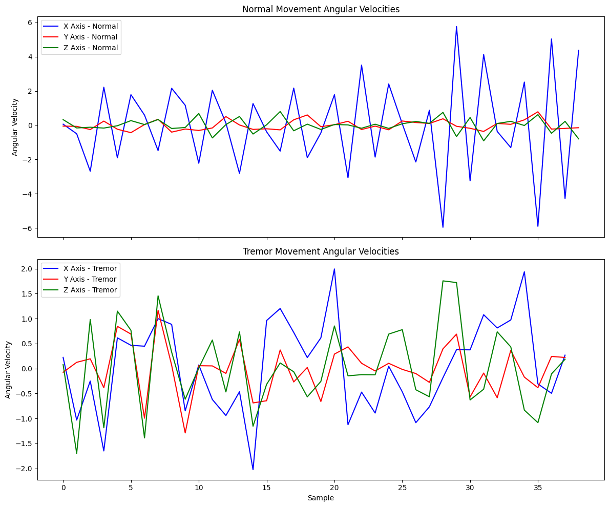

# Real-time Parkinson's Tremor Detection System

## Overview
This project aims to develop a real-time monitoring system that utilizes a gyroscope to detect and analyze tremors in individuals suspected of having Parkinson's disease. Using an embedded system built with an STM32F429ZI board and its peripherals, this system records angular velocities, calculates the root mean square (RMS) of these movements, and assesses whether the movements indicate a tremor based on predefined thresholds.

## Features
- **Tremor Detection**: Utilizes angular velocity data from a three-axis gyroscope to detect tremor-like movements.
- **Real-Time Analysis**: Provides instantaneous feedback on detected tremors and their strength (weak or strong).
- **Data Logging**: Records and displays the tremor data on an LCD, along with total time elapsed and the total distance of tremor movements.
- **User Interaction**: Includes a push-button interface to start and stop data recording, and a visual feedback system using an onboard LED.

## Hardware Components
- **STM32F429ZI Development Board**
- **LCD Display (LCD_DISCO_F429ZI)**
- **SPI Gyroscope**
- **Push Button**
- **LED Indicator**

## Software and Libraries
- **Mbed OS**: The platform for firmware development.
- **LCD_DISCO_F429ZI Library**: For LCD interactions.
- **Standard C++ Libraries**: For data processing and mathematical calculations.

## System Diagram
Below is a diagram illustrating the angular velocities measured during normal movement and during a tremor episode as the person picks up an object repeatedly, as detected by the gyroscope. Normal movements are smoother and demonstrate controlled adjustment, with velocities generally staying closer to the baseline. In contrast, there is a clear increase in both the amplitude and frequency of the angular velocities for the movement with tremor, depicting the uncontrolled, jittery motions associated with tremors. These erratic movements are reflected by the significant deviations in angular velocity.
 
*Normal vs. Tremor Movement Angular Velocities: This graph displays the angular velocity in radians per second for each axis, illustrating the difference between normal movements and those characteristic of tremors as the user repeatedly picks up an object.*

## Setup and Configuration
1. **SPI Configuration**: Set up the SPI interface with the gyroscope sensor to read angular velocities.
2. **Interrupts**: Configure interrupts for data ready from the gyroscope and button press events.
3. **Display**: Initialize the LCD to display the system status and results.

## Usage
1. **Start the System**: Press the button to begin recording gyroscopic data.
2. **Monitoring**: The LCD will display real-time data about detected tremors, total distance of tremor-like movements, and total time elapsed.
3. **Stop Recording**: After 60 seconds, it will stop data recording and display the summary of results.

## Code Description
The provided code initializes hardware components, sets up data collection from the gyroscope, processes this data to determine if it meets the criteria for tremor detection, and then displays this information on an LCD. It implements several key functions:
- **RMS Calculation**: Computes the root mean square of gyroscopic data to quantify tremor intensity.
- **Rolling Standard Deviation**: Uses a rolling window to calculate real-time standard deviation for tremor identification.
- **Tremor Detection Logic**: Determines if recorded movements are tremors based on amplitude and frequency characteristics.

This system provides a valuable tool for monitoring and analyzing tremors in real-time, which can assist in the ongoing assessment and management of Parkinson's disease.
